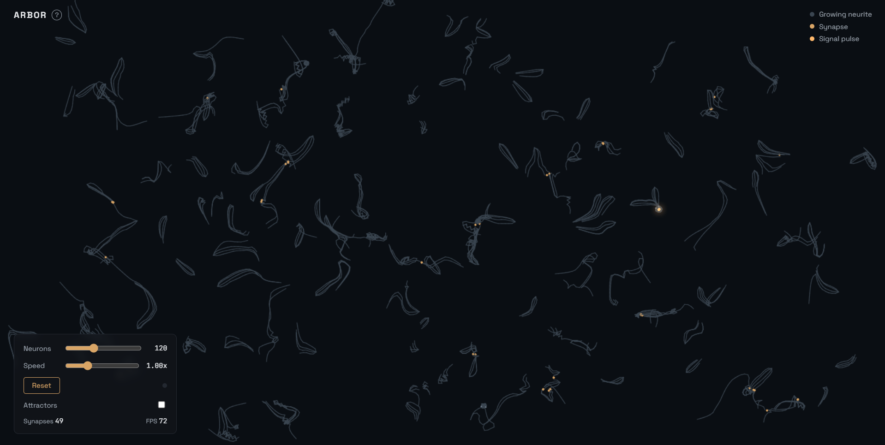

<div align="center">

# ARBOR

Axons and dendrites grow through open space, form synapses on contact, and fire traveling action potentials once the network connects.

[](https://p5js.org/)
[](https://developer.mozilla.org/en-US/docs/Web/JavaScript)
[](https://luminolous.github.io/Arbor/)
[](LICENSE)

[**Live demo**](https://luminolous.github.io/Arbor/) · [Report an issue](https://github.com/luminolous/Arbor/issues)

<br />



</div>

---

## About

ARBOR is a real-time neural growth simulation that runs entirely in the browser. Neurons grow from seed points, branch to fill open space, and form synapses wherever two growth tips from different neurons meet. Once enough synapses exist, a signal starts at one neuron and travels across the network, lighting up every connection it crosses along the way.

Nothing on screen is hand-placed. The shape of each neuron, the location of every synapse, and the path each signal takes all come out of the growth and collision rules running frame by frame. Reset the simulation and you get a different network each time, same rules, different result.

## The simulated process

Three procedural rules are doing all the work here, each loosely modeled on how real neurons behave.

Growth follows the space colonization algorithm, the same technique used to generate procedural tree branches. Every growth tip looks at a scattered field of attractor points, averages the direction toward whichever ones sit within its influence radius, and steps that way. Any attractor it gets close enough to is consumed. Run out of nearby attractors and a tip either stops or splits into two, which keeps the network pushing into empty space instead of stalling early.

Connections form the way real growth cones bump into each other: proximity, not chemistry. When two growth tips from different neurons pass within a small threshold distance, both stop and a synapse appears at that point. A spatial grid keeps this check fast even with hundreds of neurons growing on screen at once, since checking every tip against every other tip would not scale.

Once synapses exist, the neurons and their connections already form a graph. Firing a signal means walking that graph outward from a starting neuron, delaying each step in proportion to the length of the segment it crosses. The traveling dot on screen is that walk, drawn one frame at a time.

None of this reaches for an actual membrane potential or ion channel model. It is a procedural approximation, built to read as growth, connection, and signaling without simulating the underlying biophysics.

## Features

- Space colonization growth for hundreds of neurons in real time, tuned to branch into open space rather than dying out early
- Spatial grid collision detection between growth tips, so synapse checks stay cheap at scale
- Graph-based signal propagation with delay proportional to distance, firing on its own at random intervals or on demand from the Fire button
- Layered rendering: finished segments draw once to an offscreen buffer, only growing tips and traveling pulses get redrawn each frame
- Neuron count and growth speed sliders, plus a Reset button that regenerates the whole network
- Attractor field debug toggle, off by default, for seeing the target points that steer growth direction
- An in-page info panel explaining the simulation, opened from the "?" button next to the title
- A small legend in the corner keyed to the colors on screen

## Tech stack

| Layer | Choice | Why |
|-------|--------|-----|
| Rendering | p5.js, loaded from a CDN | Canvas setup, the draw loop, and vector helpers, without writing a render pipeline by hand |
| Language | Vanilla JavaScript | No framework, no bundler, matches the no-build-step target from day one |
| Style | Hand-written CSS | One fixed-viewport canvas and a floating panel do not need a CSS framework |
| Fonts | Space Grotesk and JetBrains Mono, Google Fonts CDN | Space Grotesk for headings and labels, JetBrains Mono for numeric readouts |
| Deploy | GitHub Pages | Static files only, so there is nothing to build before publishing |

## Project layout

```
index.html          canvas, control panel, and info panel markup
style.css           all styles: dark theme, layout, control panel
js/
  sketch.js         p5.js setup() and draw(), ties everything together
  neuron.js         Neuron, Tip, and Segment classes
  sca.js            space colonization growth step, attractor field
  spatialGrid.js    grid hash used for tip and attractor lookups
  synapse.js        synapse graph and signal propagation
  controls.js       control panel wiring: sliders, buttons, toggles
assets/
  preview.png       preview image used in this README
.agents/
  ARCHITECTURE.md   data model, algorithm, and build order
  DESIGN.md         visual direction and control panel spec
  CLAUDE.md         working conventions for coding sessions on this repo
```

## Acknowledgments

- [p5.js](https://p5js.org/) for canvas setup, the draw loop, and vector math
- [Google Fonts](https://fonts.google.com/) for Space Grotesk and JetBrains Mono, both loaded via CDN
- The space colonization algorithm behind the growth logic, adapted from Runions et al. (see References)

## References

```
Runions, A., Lane, B., & Prusinkiewicz, P. (2007). Modeling trees with a space colonization algorithm. In *Eurographics Workshop on Natural Phenomena* (pp. 63-70). The Eurographics Association. https://doi.org/10.2312/NPH/NPH07/063-070
```

## License

Released under the MIT license. See [LICENSE](LICENSE).
